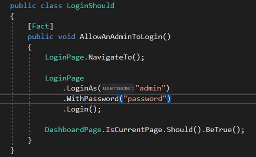
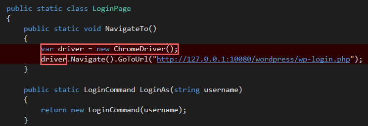
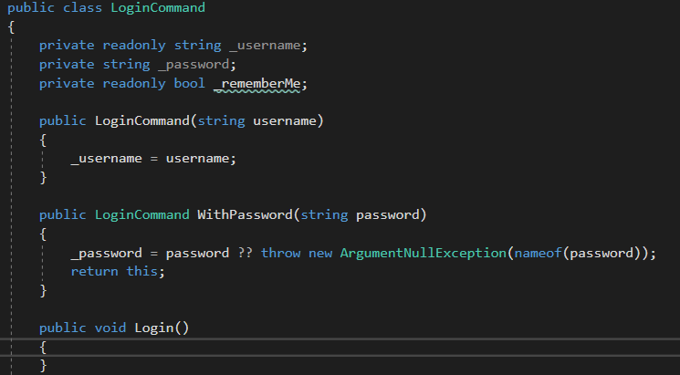
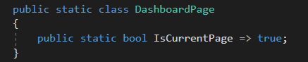
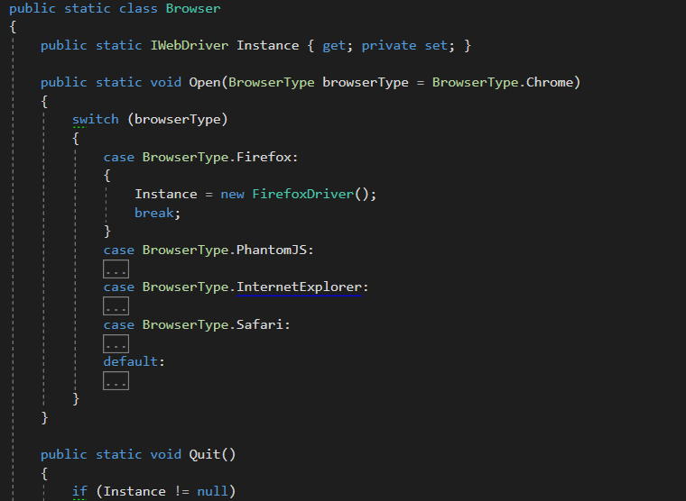
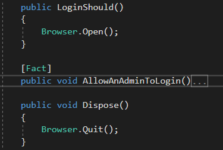

# Instant Word Press Selenium Kata
Test exploration with my friend *Vikas*. Its always a pleasure working with people who have a passion to learn and a desire to make the world a better place. Vicas had a desire of automating his manual testing and to learn and better his skills. Vicas, single handily took on the task himself to automate a bunch of selenium tests in the current company I am working in, and without any dev experience, put together some impressive test journeys helping maintain the integrity of an ever changing project.

In his original attempt, he tended to make common mistakes newbies make when attempting to create their first stab at the dev test world and then to have ideas influenced by complicated developers.

This Kata is an exploration of ideas, trying to reduce the unintentional complexity developers bring to non-developers but still honouring TDD concepts and the core ideas of testing and building your code up in small iterations.

## Setup windows environment
1. Download https://windowsreport.com/install-wordpress-windows-10/ ready to selenium test this.
2. **XUnit** is the testing framework I used. This is simple test framework, less ceremony and is in my opinion the best test framework to use with .net. Here is a cheat-sheet to help you with a quick reference - https://www.planetgeek.ch/wp-content/uploads/2011/12/xUnitCheatSheet1.pdf.
3. Install fluent assertions so that test logic reads like English making it easier to develop.

## Theory behind what you will develop
- This course is for Developers or QA
- This should help QA people who don’t necessarily know a lot about code, enough to create tests
- Types of testing
  - **Unit testing** is the smallest unit of code in isolation ideally done through TDD
  - **Integration testing** tests more several components together but will still focus the code
  - **Black Box automated testing** is the system from the perspective of the user
- The reasons we do Black Box testing (BAT):
  - **Regression** of an agile environment
  -	**Absolute requirements** explaining exactly what I wanted and what you agreed to
  -	**Leverage** by testing more production code with fewer lines of BAT Code
- Common Failure Points

  -	**Recorded Brittle Tests** are difficult to change so people usually give up
  -	Not building a **framework**
  -	Writing tests like **code**
- **Separate Automation Framework** and make tests that don’t work directly against the framework
- **Simple tests** make it easy to see what we are doing
- **Test drive** the creation of the Framework
- The **System Under Test** (SUT) will be https://wordpress.org/ or https://instantwp.com
- Each layer interacts with the layer below it
- The **Page Pattern** helps group logic
- Figure out **user interactions** like searching or deleting the posts
- Thinking about the layers
- Think about ease of use when designing, if it is not easy to use, it will not be used
- Some basic rules
  - Never require tests to declare **variables**
  - Never require tests to create the **“new”** keyword to create new objects
  - Never require tests to **manage state** of their own 
  - Never expose the browser or the **DOM** or let the test manipulate it
    directly
  - Reduce the number of **parameters** for API Calls when possible
  - Always use **default values** instead, requiring parameters where possible
- **Static Methods** are favoured, shock!, because we are making it easier to use and so this is a simple way to make it more user friendly. Developers will be disagreeing with this point, as I did when I first looked at this, but that is our notion of correctness kicking in. This is about simplifying the test structure to make it easy to use for Non-developers so keep that in mind and this point is easy to diggest
- **Domain Specific Language (DSL)** needs to be used to expose for test usage
  - **Internal DSL**, using the programming language specific to domain
  - **External DSL** creates an entire language to write your tests in but is a lot of work
- **Running the tests** needs to be considered up front or is a quick way to get the results
- **Smoke tests** will give us a chance to generate the framework and will give the greatest coverage

## Test Strategy

1. Start with your first simple test to generate the basic code

   

2. Generate the automation code to deal with the simplest functionality to make the test pass

   

3. Generate login command to persist the data assigned

   

4. Generate dashboard page and default state to make test pass

   

5. Generate a browser class for opening and quitting the browser and add support for all types of browser

   

6. Reference it in the test

   

7. Implement the actual login logic ...

   

   